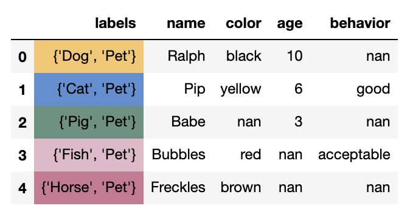

# NeonPandas

A Pandas interface to the Neo4j graph database.

Inspired by projects such as [geopandas](https://github.com/geopandas/geopandas), [huntlib](https://github.com/target/huntlib), and [cyberpandas](https://github.com/ContinuumIO/cyberpandas), `neonpandas` facilitates interacting with Neo4j graph data with all of the features of the Pandas/NumPy/SciPy stack.

This is accomplished by NodeFrames and EdgeFrames, which are Pandas DataFrames with added constraints such as enforced _labels_ and _id_ columns that ensure proper integration with Neo4j.

## Example Usage
`import neonpandas as npd`

`data = [{'name': 'Ralph', 'species': 'Dog', 'age': 10}, {'name': 'Pip', 'species': 'Cat', 'age': 7}, {'name': 'Babe', 'species': 'Pig', 'age': 3}]`

Create a NodeFrame from any data suitable for a Pandas DataFrame
The **labels** column is a key component of the NodeFrame, and represents the _labels_ 
for each node in Neo4j. The **labels** column can be created when the NodeFrame is
instantiated or through the set_labels method manually.

`pets = npd.NodeFrame(data, lbl_col='species', labels={'Pet'})`

### TODO: Add section on EdgeFrame